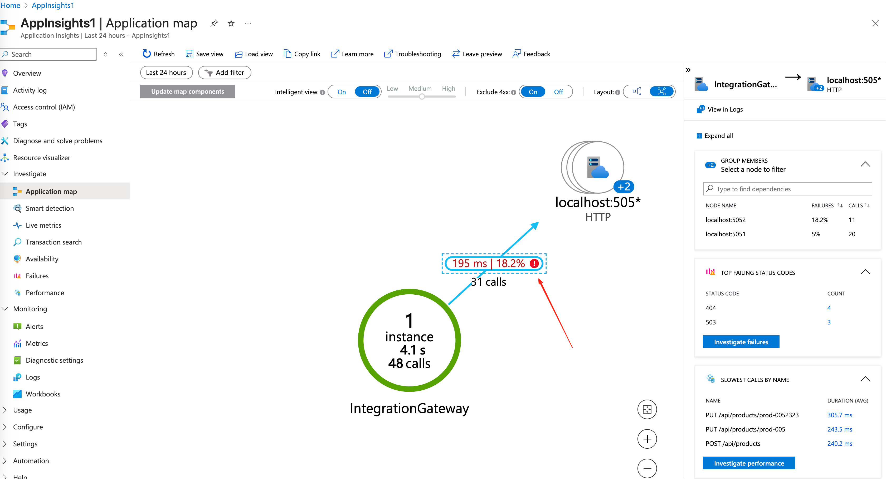
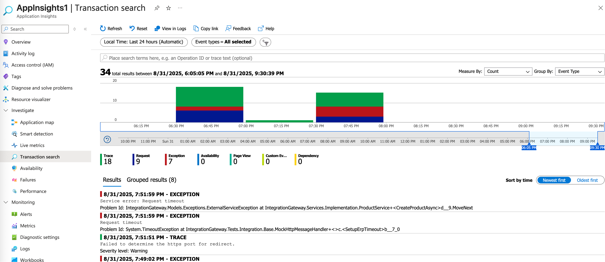
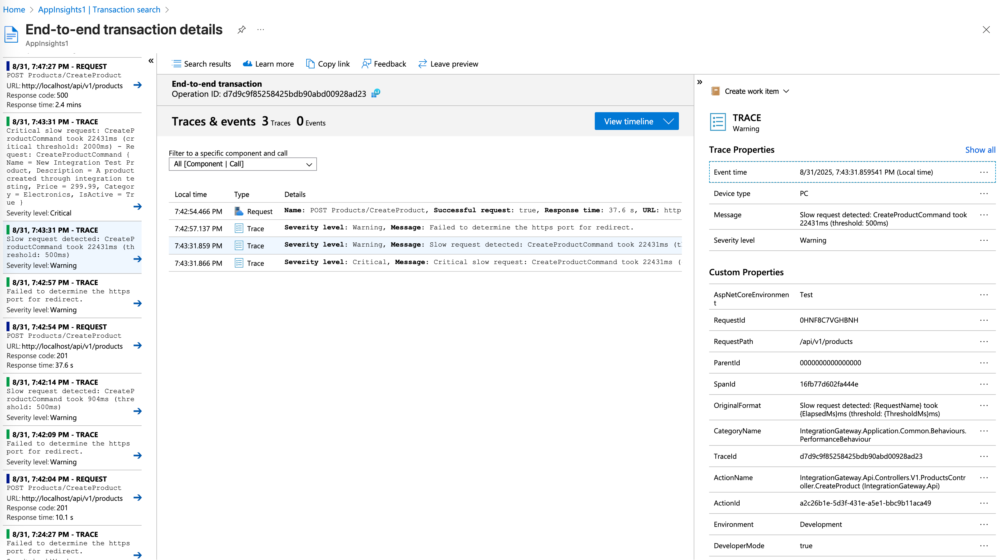
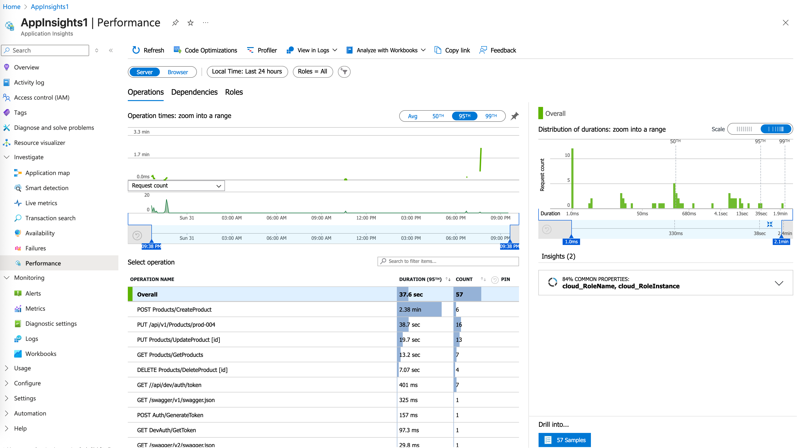
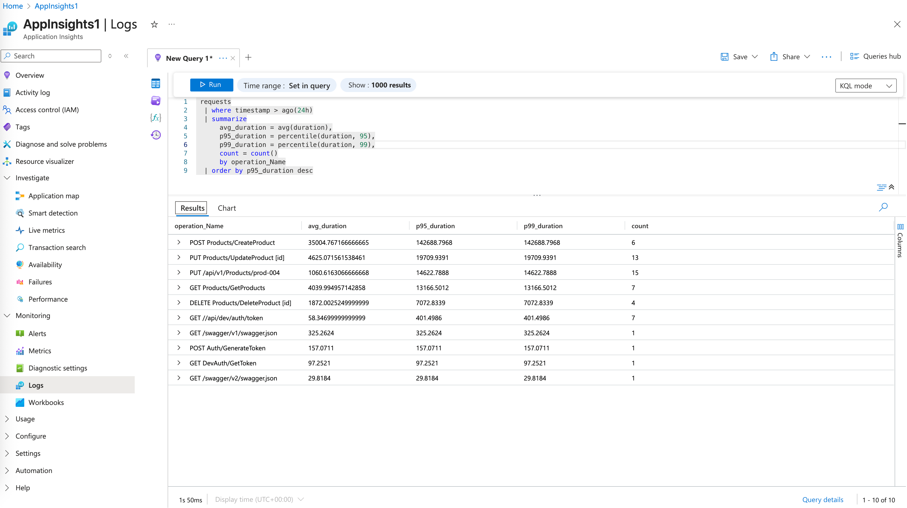

# Application Insights Observability Guide for Integration Debugging

This guide demonstrates 4 key Application Insights methods for debugging slow/failed integrations with ERP and Warehouse services through logs, metrics, and distributed traces.

## Method 1: Application Map - Visual Service Dependencies

Application Map provides a real-time topology view of your service dependencies, showing average response times and failure rates for ERP and Warehouse integrations. Use this to quickly identify which downstream service is causing performance bottlenecks or failures.

## Method 2: Transaction Search - End-to-End Request Tracing  

Transaction Search enables distributed tracing across the entire request lifecycle from API Gateway through ERP/Warehouse services. Filter by duration or failure status to identify slow transactions and trace exactly where time is spent in the integration chain.

## Method 3: Performance Blade - Operation Metrics

The Performance blade shows detailed metrics for API operations and dependency calls, ranking them by duration and frequency. Use this to identify the slowest integration endpoints and understand which ERP/Warehouse operations are consuming the most time.

## Method 4: Logs with KQL - Custom Analysis

KQL queries against Application Insights logs provide deep observability into integration behavior, allowing custom analysis of error patterns, performance trends, and business logic flows. Write targeted queries to correlate logs, metrics, and traces for comprehensive debugging.

## Quick Reference

- **Immediate issues**: Start with Application Map for service health overview
- **Slow requests**: Use Transaction Search to trace end-to-end execution
- **Performance ranking**: Check Performance blade for operation benchmarks  
- **Deep analysis**: Write KQL queries for custom investigation patterns